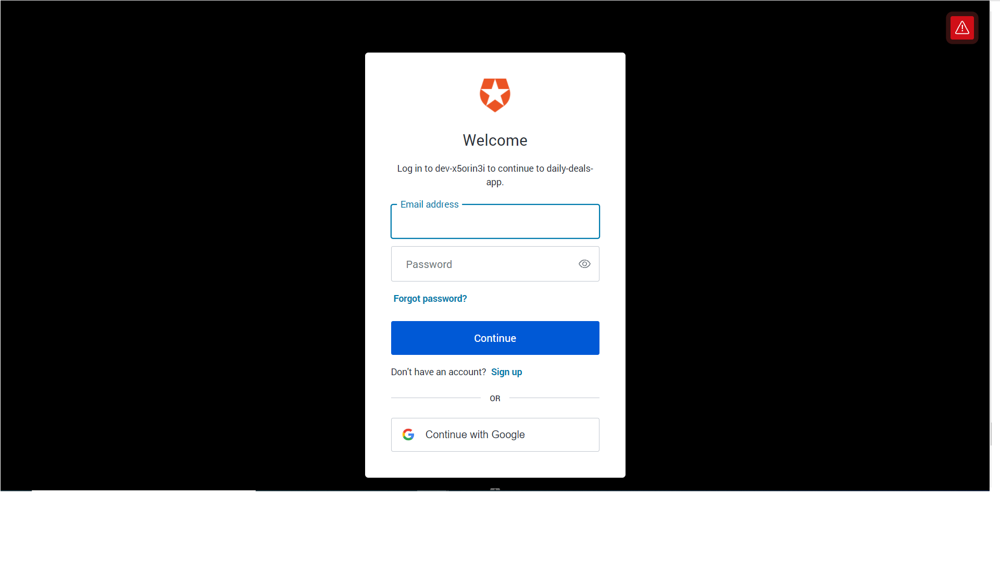

<h3 align="center">E-Store Serverless CRUD web application</h3>

---

## Table of Contents
- [Table of Contents](#table-of-contents)
- [About the project:](#about-the-project)
- [Technologies used on the project:](#technologies-used-on-the-project)
- [Functionalities:](#functionalities)
- [Tech Stack:](#tech-stack)
- [Prerequisites:](#prerequisites)
- [Getting Started:](#getting-started)
  - [Go to [backend]  by running:](#go-to-backend--by-running)
  - [Go to [frontend] by running:](#go-to-frontend-by-running)
    - [Angular Crud](#angular-crud)
    - [Development server](#development-server)
    - [Code scaffolding](#code-scaffolding)
    - [Build](#build)
    - [Running unit tests](#running-unit-tests)
    - [Running end-to-end tests](#running-end-to-end-tests)
    - [Further help](#further-help)
- [API Endpoints:](#api-endpoints)
- [How to use the application:](#how-to-use-the-application)
  - [Create a new deal](#create-a-new-deal)
  - [Update a deal](#update-a-deal)
  - [Delete a deal](#delete-a-deal)
  - [Make a deal as Special Deal](#make-a-deal-as-special-deal)
  - [Upload an image for a Deal](#upload-an-image-for-a-deal)
  - [Get details for a deal :](#get-details-for-a-deal-)
- [Postman collection:](#postman-collection)

## About the project:

**E-Store-Serverless** is a basic Serverless web application as a CRUD of the Web store with deals. 

## Technologies used on the project:
 
 - NodeJS
 - Angular 12
 - JSON
 - Bootstrap
 - auth0
 - karma
 - jasmine
 - typescript
 - CSS
 - HTML5

## Functionalities:
- [x] Application can be able to CREATE, UPDATE, DELETE, VIEW and UPLOAD IMAGES for items (Deals).
- [x] Visitor (non authenticated user) can see deals (Regular and Special deals) which got created by users of the app.
- [x] Application can be login/logout and show contents of the current user. 
- [x] User needs to be authenticated to could perform CRUD operations to Deal items that he/she has created

## Tech Stack: 
- [Serverless Framework](https://www.serverless.com/) as Deployment Framework 
- [Angular](https://angular.io/) for the Frontend 
- [AWS](https://aws.amazon.com/) as cloud provider for following services : DynamoDB, Cloudwatch, Lambda, API Gateway, Cloudformation, S3, X-Ray, AWS SDK
- [Auth0](auth0.com)  as Authentication Framework 
- [Node.js](https://github.com/nodejs/node) for the Backend

## Prerequisites:
* <a href="https://manage.auth0.com/" target="_blank">Auth0 account</a>
* <a href="https://github.com" target="_blank">GitHub account</a>
* Serverless 
   * Create a <a href="https://dashboard.serverless.com/" target="_blank">Serverless account</a> user
   * Install the Serverless Framework’s CLI  (up to VERSION=2.21.1). Refer to the <a href="https://www.serverless.com/framework/docs/getting-started/" target="_blank">official documentation</a> for more help.
   ```bash
   npm install -g serverless@2.21.1
   serverless --version
   ```
   * Login and configure serverless to use the AWS credentials 
   ```bash
   # Login to your dashboard from the CLI. It will ask to open your browser and finish the process.
   serverless login
   # Configure serverless to use the AWS credentials to deploy the application
   # You need to have a pair of Access key (YOUR_ACCESS_KEY_ID and YOUR_SECRET_KEY) of an IAM user with Admin access permissions
   sls config credentials --provider aws --key YOUR_ACCESS_KEY_ID --secret YOUR_SECRET_KEY --profile serverless
   ```
   * you need to edit the `environment.ts` file in the `frontend/environment` folder. This file configures your client application  and contains an API endpoint and Auth0      
     configuration:
   ```ts
   const apiId = '...' API Gateway id
   export const apiEndpoint = `https://${apiId}.execute-api.us-east-1.amazonaws.com/dev`

   export const authConfig = {
   domain: '...',    // Domain from Auth0
   clientId: '...',  // Client id from an Auth0 application
   callbackUrl: 'http://localhost:4200/callback'
   }
   ```

## Getting Started:

### Go to [backend]  by running: 
```
cd backend
npm install
serverless deploy -v
```

### Go to [frontend] by running:
```
cd frontend
npm install
ng serve
```

#### Angular Crud

This project was generated with [Angular CLI](https://github.com/angular/angular-cli) version 12.2.11.

#### Development server

Run `ng serve` for a dev server. Navigate to `http://localhost:4200/`. The app will automatically reload if you change any of the source files.

#### Code scaffolding

Run `ng generate component component-name` to generate a new component. You can also use `ng generate directive|pipe|service|class|guard|interface|enum|module`.

#### Build

Run `ng build` to build the project. The build artifacts will be stored in the `dist/` directory.

#### Running unit tests

Run `ng test` to execute the unit tests via [Karma](https://karma-runner.github.io).

#### Running end-to-end tests

Run `ng e2e` to execute the end-to-end tests via a platform of your choice. To use this command, you need to first add a package that implements end-to-end testing capabilities.

#### Further help

To get more help on the Angular CLI use `ng help` or go check out the [Angular CLI Overview and Command Reference](https://angular.io/cli) page.


## API Endpoints: 
|            **Method**                      | **endpoint** |
| -------------------------------------------|--------------|
| **GET**    (Get Regular Deals)             | `https://ficmpgzsvc.execute-api.us-east-1.amazonaws.com/dev/RegularDeals`|
| **GET**    (Get Special Deals)             | `https://ficmpgzsvc.execute-api.us-east-1.amazonaws.com/dev/SpecialDeals`|
| **GET**    (Get USER'S Deals)              | `https://ficmpgzsvc.execute-api.us-east-1.amazonaws.com/dev/deals`|
| **POST**   (Add Deal)                      | `https://ficmpgzsvc.execute-api.us-east-1.amazonaws.com/dev/deals`|
| **PATCH**  (Update Deal)                   | `https://ficmpgzsvc.execute-api.us-east-1.amazonaws.com/dev/deals/{dealId}`|
| **DELETE** (Delete Deal                    | `https://ficmpgzsvc.execute-api.us-east-1.amazonaws.com/dev/deals/{dealId}`|
| **PATCH**  (Add special deal)              | `https://ficmpgzsvc.execute-api.us-east-1.amazonaws.com/dev/deals/{dealId}/special`|
| **GET**    (Get Deal's Details)            | `https://ficmpgzsvc.execute-api.us-east-1.amazonaws.com/dev/deals/{dealId}`| 
| **POST**   (Upload an image to a Deal)     | `https://ficmpgzsvc.execute-api.us-east-1.amazonaws.com/dev/deals/{dealId}/attachment`|

## How to use the application: 

1. First, Home page is displayed to users and visitors of the webstore, showing all the deals by category : Regular or Special Deals


2. Second, users should login with Google in order to use Auth0 authentication. This application only has option to login with Google account. 


3. After authentication success, users would be redirected to their own home page where they could perform CRUD operations on the app. 


### Create a new deal 
To create a new deal, click on ```ADD NEW DEAL``` button at the user's home page (Deals-List).
1. Fill the fields on the form .
2. Click ```Submit```


### Update a deal
To update an existing deal, click on ```Edit``` button of the newly created deal at the user's home page (Deals-List).
1. Make update in Edit page
2. Click ```Submit```


### Delete a deal
To delete a deal, click on the ```Delete``` button  of the newly created deal at the user's home page (Deals-List).
1. Press Ok on the confirmation dialog


### Make a deal as Special Deal
To create special deals, click on the ```Special Deal``` button of the newly created deal  at the user's home page (Deals-List).
1. Fill the sale price field on the form
2. Click ```Submit```


### Upload an image for a Deal
To add an image for the newly created deal, click on the ```Image Upload``` button  at the user's home page (Deals-List).
1. Click on ```Browse``` button to Choose an image to upload
2. Click ```Upload``` to upload the image 


### Get details for a deal :
To get more details on the deal, click on the ```DETAILS``` button  at the home page.


## Postman collection:

An alternative way to test the API, you can use the Postman collection that contains sample requests. You can find a Postman collection in this project. To import this collection, do the following.

Click on the import button:


Click on the "Choose Files":


Select a file to import:


Right click on the imported collection to set variables for the collection:


Provide variables for the collection (similarly to how this was done in the course):


